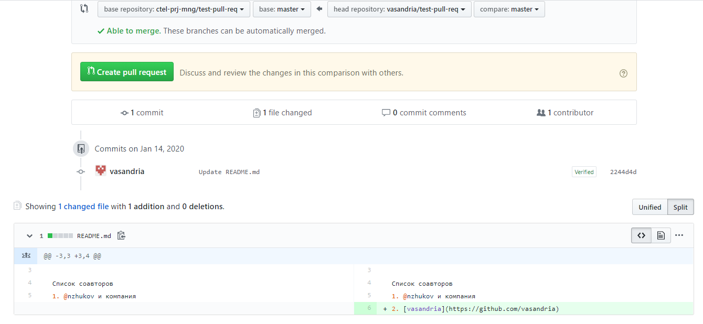
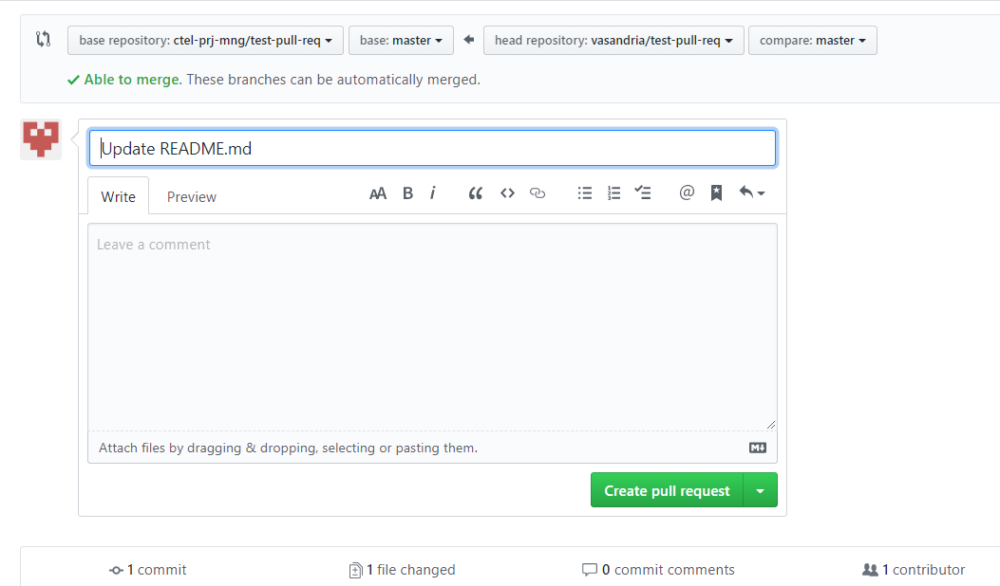
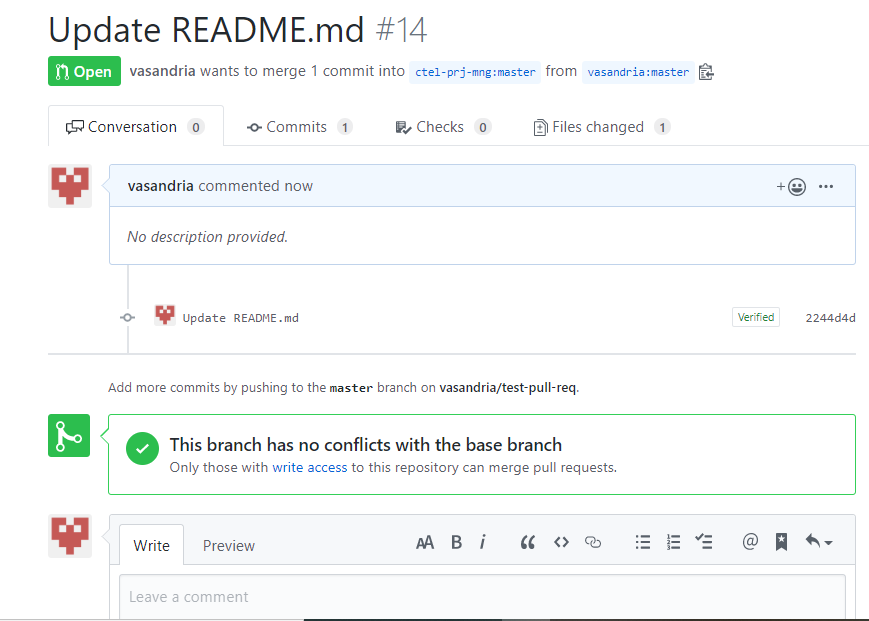

# lr11UPP
## Сделать форк репозитория https://github.com/ctel-prj-mng/test-pull-req
Добавить ссылку на свой логин (сделать ссылкой) в файле README.md форкнутого репозитория. 
Сделать pull-request предложив внести в оригинальный репозиторий (https://github.com/ctel-prj-mng/test-pull-req) изменения, которые были сделаны в форинтом репозитории.

